# Painterly Image Rendering

This is my implementation of the paper by [Aaron Hertzmann "Painterly rendering with curved brush strokes of multiple sizes"](https://dl.acm.org/citation.cfm?id=280951). 

This was done for a final project in CSC 361 - Computer Graphics.
A full write-up can be found [here](https://github.com/awoh/Painterly-Image-Rendering/blob/master/writeup.pdf).

To use this program, you must supply the path to a **.ppm image.**

We are able to render images in different painted styles, including impressionist and pointillist. The render's appearance depends on:
* Minimum brush size
* Brush size ratio 
* Number of brushes used
* New stroke threshold
* Minimum and maximum stroke length
* Curvature filture (determines how much curviness strokes have)

To paint images, we apply a blur to the original image with an intensity based on the size of the current brush being used to paint. We compare the blurred image to our current canvas to determine which areas should be painted with new strokes. We model strokes using cubic B-splines.

### Sample Renders

 

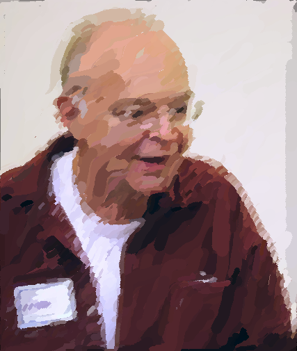

 

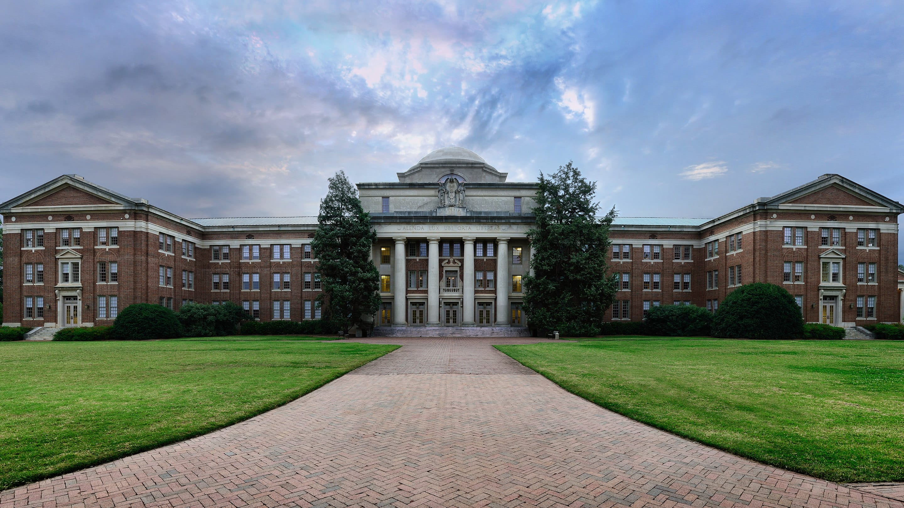
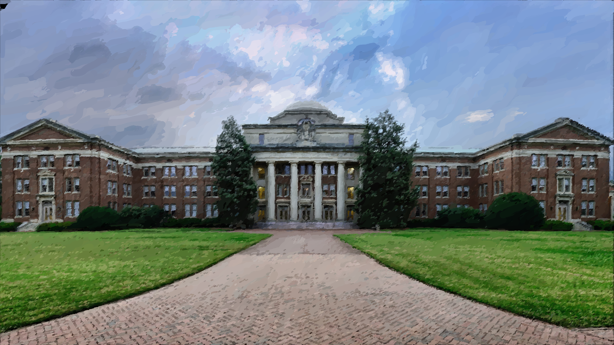

 

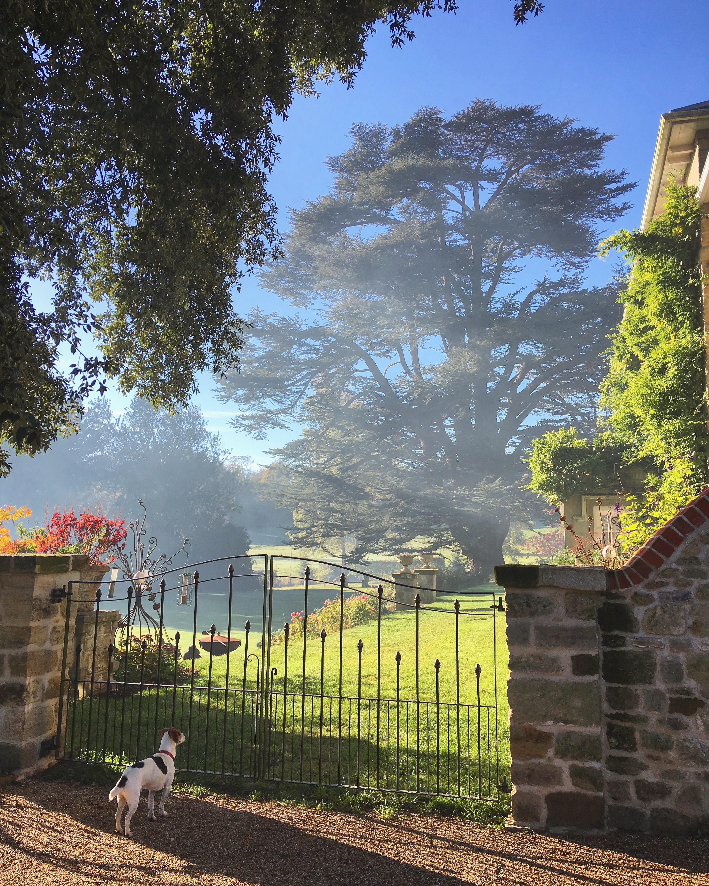

 

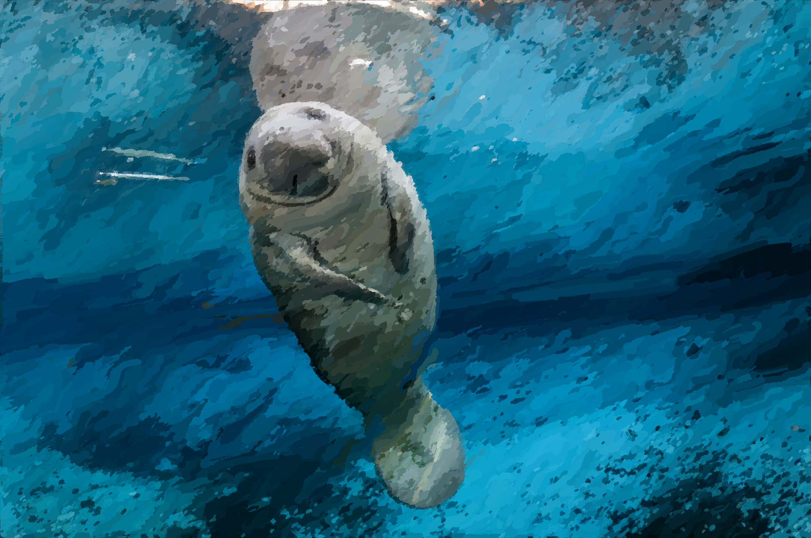

 

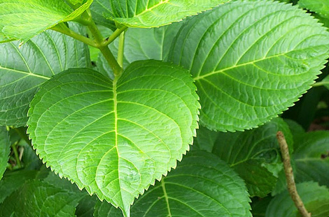

 

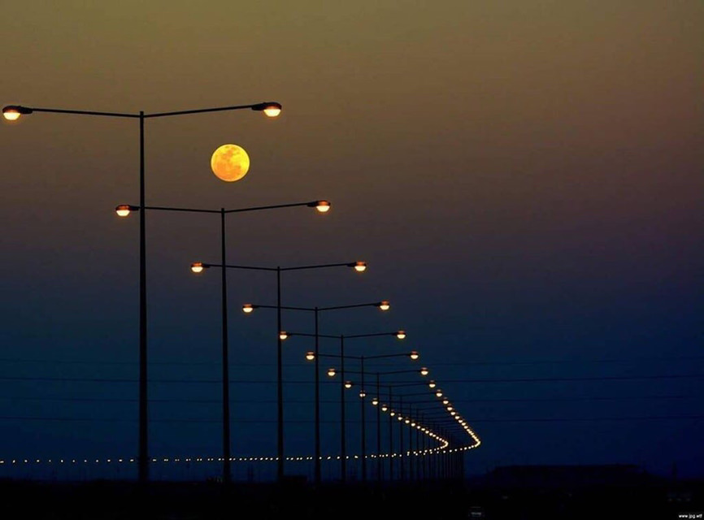
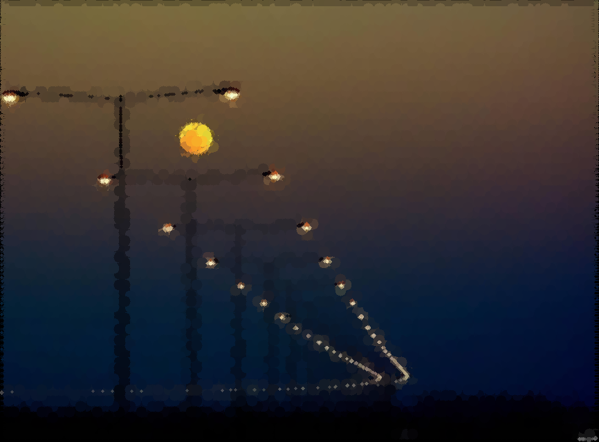

 

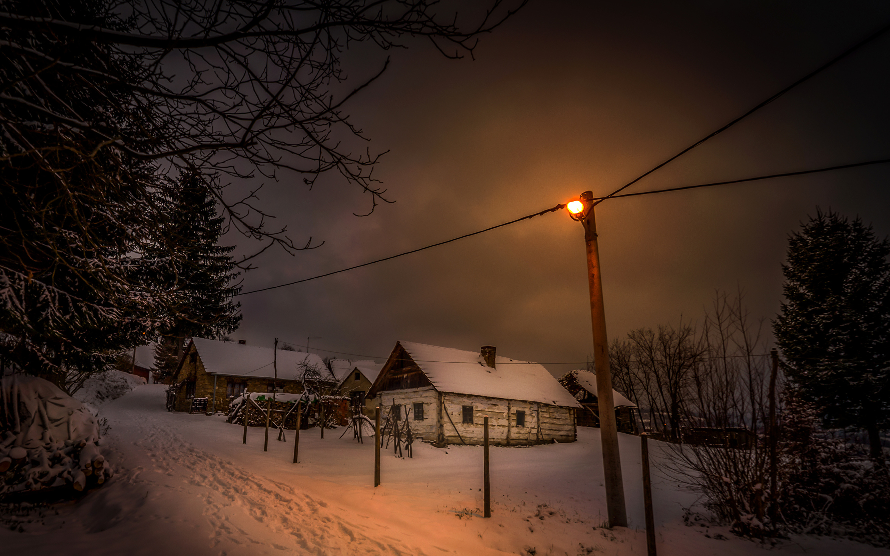
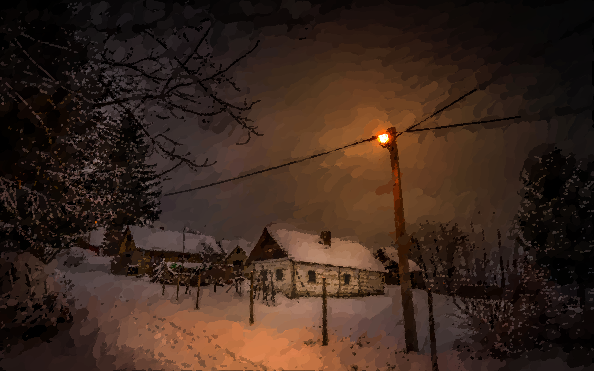

 

 

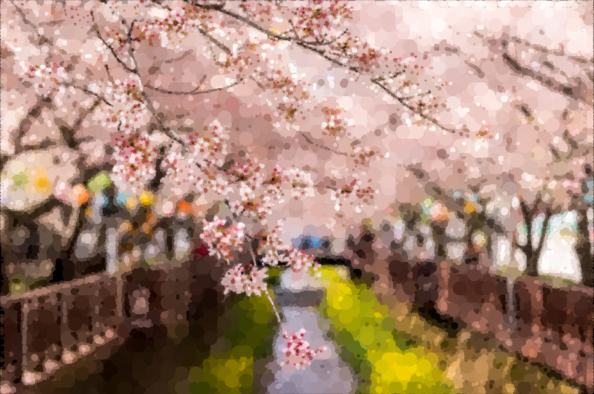

 

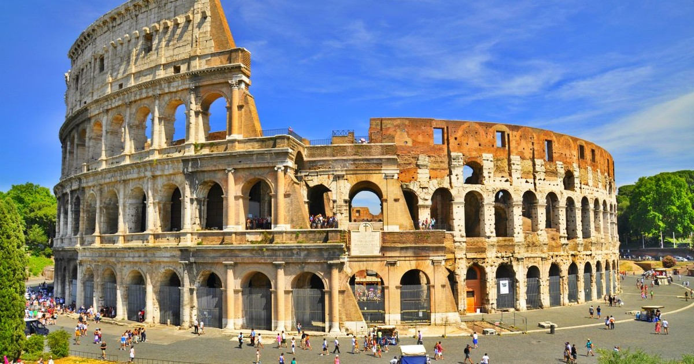
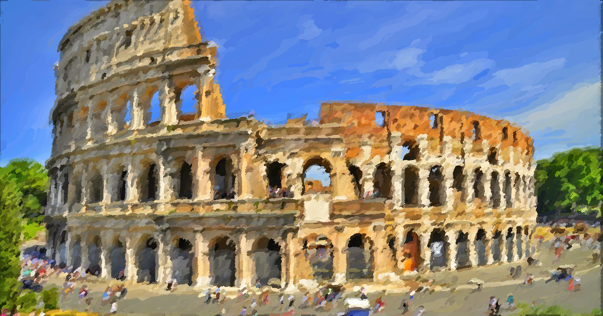

 

### Useful Links

[Interactive B-spline drawing tool](http://nurbscalculator.in/)
<!-- via https://stackoverflow.com/questions/53564615/how-do-i-get-the-b-spline-curve-to-connect-to-the-final-control-point -->

[Another interactive B-spline drawing tool](http://research.engr.utexas.edu/cagd/B-Spline-Interaction/)
